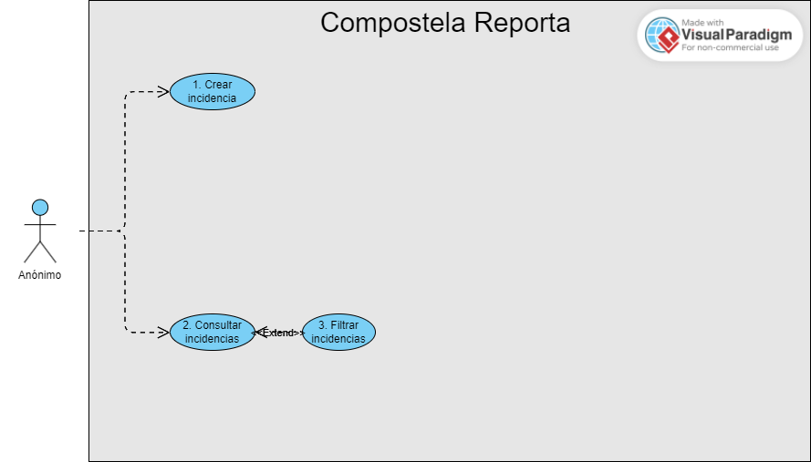
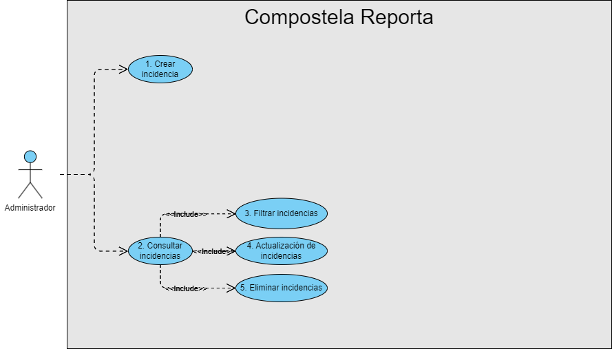
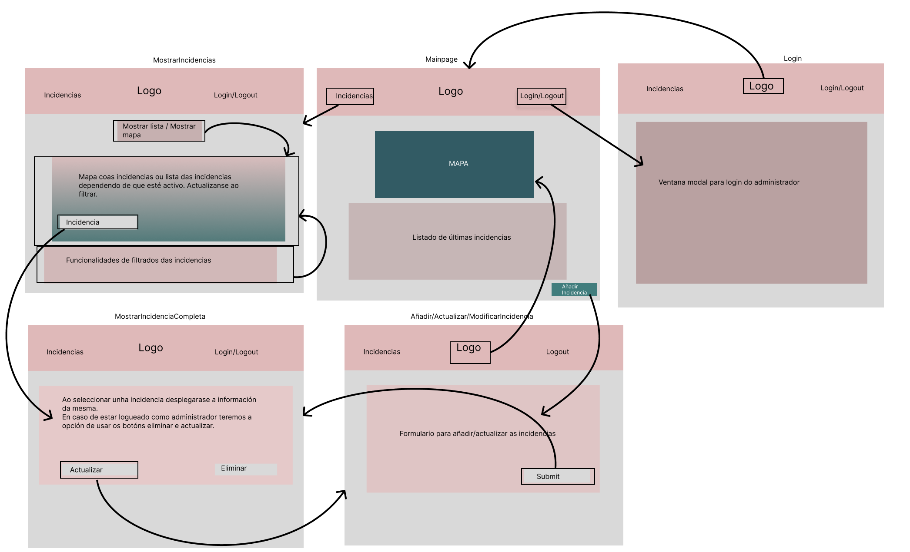
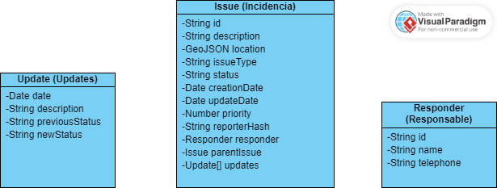
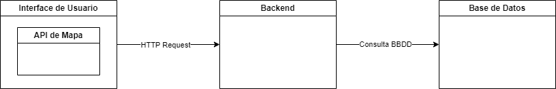

# Deseño

## a) Casos de uso.

### Casos de uso usuario anónimo

### Casos de uso usuario administrador

## b) Deseño da interface de usuarios.

### Diagrama de navegación e mockups

## c) Diagrama de Base de Datos.

Ao ser unha base de datos non relacional non cabe a representación co diagrama de entidad/relación. Represento esta relación cun diagrama de clases xa que me parece a forma máis similar para representar a estructura desta base de datos.

En realidade solo habrá dúas coleccións na base de datos, Responder e Issue. Updates non será necesario crear unha colección específica, xa que cada update vai estar relacionado con solo unha incidencia, polo que crearemos un listado de incidencias dentro da colección Issue.

## d) Diagrama de compoñentes software que constitúen o produto e de despregue.

Teremos unha interface na que contaremos cunha API de servicios de mapas para facer consultas de coordenadas e pintar as incidencias no propio mapa.
A interface estará relacionado co API REST de backend que fai as peticions HTTP Request.
O backend fará as consultas á base de datos para recoller ou modificar/eliminar a información almacenada na base de datos.

