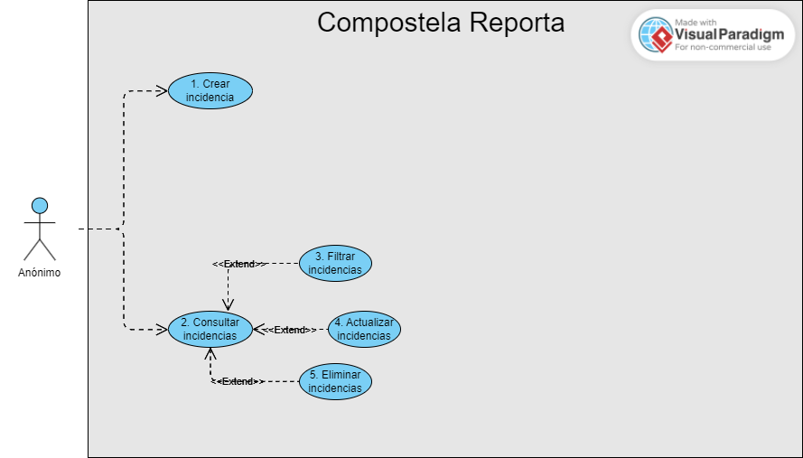
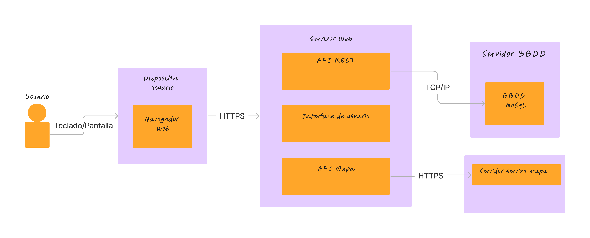

# Deseño

## a) Casos de uso.

Nos casos de uso temos ao usuario anónimo que non require de identificación, e o usuario administrador.

O usuario anónimo solo vai poder consultar e crear incidencias, mentres que o administrador vai ser capaz de editar e eliminar estas incidencias.

### Casos de uso usuario anónimo

### Casos de uso usuario administrador

## b) Deseño da interface de usuarios.

### Diagrama de navegación e mockups

## c) Diagrama de Base de Datos.

Ao ser unha base de datos non relacional non cabe a representación co diagrama de entidad/relación. Represento esta relación cun diagrama de clases xa que me parece a forma máis similar para representar a estructura desta base de datos.

En realidade solo habrá dúas coleccións na base de datos, Responder e Issue. Updates non será necesario crear unha colección específica, xa que cada update vai estar relacionado con solo unha incidencia, polo que crearemos un listado de incidencias dentro da colección Issue.

## d) Diagrama de compoñentes software que constitúen o produto e de despregue.

Na nosa aplicación, disporemos dunha interface de usuario a través da cal os usuarios poderán interactuar co sistema. Esta interface estará conectada a unha API de servizos de mapas, que nos permitirá realizar consultas de coordenadas e visualizar as incidencias sobre o mapa da zona.

Esta interface de usuario estará estreitamente relacionada co backend da aplicación, que opera mediante un API REST. O backend xestionará todas as peticións HTTP realizadas pola interface co servidor.

O backend, realizará consultas á base de datos para obter, modificar ou eliminar a información relacionada coas incidencias rexistradas. Estas consultas permitirán manter actualizada a información almacenada na base de datos.

### Diagrama de compoñentes de software

### Diagrama de despregamento

