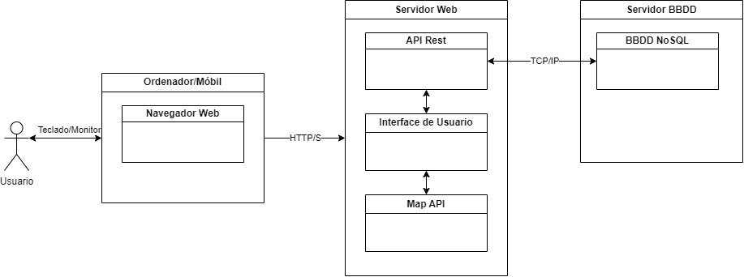

# Implantación

Despregado mediante a plataforma online render.com. O proxecto está accesible dende o link. https://compostelareporta.me/

# Diagrama de despregue e Diagrama de Compoñentes de software



## Servizo Web:

Despregado en render.com:

| Servicio Web | Linguaxes / Frameworks |
| ------------ | ---------------------- |
| Frontend     | Vue 3 JS - JavaScript  |
| Backend      | Express JS - Node JS   |

## Servidor BBDD:

Despregado en MongoDB Atlas:

- Base de datos: MongoDB

## Servidor Servizo Mapa:

- Leaflet: Obtemos mapa de OpenStreetMap [https://www.openstreetmap.org/](https://www.openstreetmap.org/) a través da API Leaflet.

# Manual técnico

## Manual de posta en produción.

## Pasos comúns

- Primeiro paso é acceder a **CompostelaReporta/.env_DATAExample** e modificar o nome para .env. Despois modifica-los datos para que utilice este .env para a nosa aplicación back-end. Por defecto está configurada a URI da nosa BBDD despregada en Docker.

_Contido do .env_DATAEXAMPLE_

```
DBUSERNAME=NomeDeUsuarioBaseDeDatos
DBPASSWORD=ContrasinalDaBaseDeDatos
MONGODB_URI=mongodb://mongo:27017/CompostelaReporta
PORT=3001
JWT_SECRET=tokenSecreto
```

- Segundo paso é acceder a **FrontCompostelaReporta/main.js** aquí temos unha variable coa URL do backend con un provide para que sexa accesible a tódolos compoñentes da nosa aplicación (Localizado nas _liñas 81 e 84_). Están configurado na liña 81 a URL para o uso do contedor docker en local e a liña 84 coa URL despregada en render.com.

_Contido do main.js liña 81_

```
app.provide('backendServerAddress', 'http://localhost:3001');
```

### Opción a: Despregue en render.com e MongoDB Atlas:

#### Prerrequisitos Hardware:

- Ningún hardware específico é necesario, xa que render.com e MongoDB Atlas xestionarán a infraestrutura por ti.

#### Software que Debe ser Instalado:

- Non é necesario instalar ningún software adicional, xa que render.com e MongoDB Atlas teñen as súas propias plataformas e ferramentas en liña.

#### Carga Inicial da BD e/ou Migracións:

- Configura a túa aplicación para conectar con MongoDB Atlas utilizando a URL de conexión fornecida por MongoDB Atlas.
- Se é necesario, realiza a carga inicial dos datos na base de datos MongoDB Atlas desde o teu entorno de desenvolvemento. Polo que vin non hai forma de facelo na propia aplicación polo que deberías ter instalado o MongoDB Database Tools no teu contorno e utiliza-lo seguinte código para exportar:

```
  mongodump --uri "mongodb+srv://<username>:<password>@<cluster-address>/<database-name>" --out /path/to/backup
```

- E o seguinte para importar:

```
  mongorestore --uri="mongodb+srv://<username>:<password>@<cluster>/<database>" <path_to_dump_directory>
```

#### Altas en Servidores na Nube, Suscricións:

- Crea unha conta en render.com e MongoDB Atlas.
- Configura os teus servizos en render.com para despregar o frontend e o backend da túa aplicación. Simplemente terás que acceder coa tua conta de Git (por exemplo GitHub) e importar os repositorios en render.com. Render detectará automáticamente os Dockerfile de cada un dos repositorios e utilizaraos para configurar e desprega-los servizos.
- En Render tamén podrás configura-lo dominio que desexes utilizar para redirixilo á túa aplicación.

- Configura a túa base de datos MongoDB Atlas e asegúrate de establecer as políticas de seguridade adecuadas.

#### Outra Información Necesaria:

- Configura os dominios en render.com para garantir a seguridade e a accesibilidade da túa aplicación. En canto aos certificados SSL render.com xestionase automáticamente.

### Opción b: Despregue utilizando Docker-compose:

#### Prerrequisitos Hardware:

- Un servidor con recursos suficientes para executar os contedores Docker.

#### Software que Debe ser Instalado:

- Docker e Docker-compose deben estar instalados no servidor.

#### Carga Inicial da BD e/ou Migracións:

- Utiliza o arquivo docker-compose.yaml que está na carpeta base do código do proxecto para cargar os contenedores. **Recorda de modifica-las rutas dos volumes se cambias a estructura das carpetas do proxecto subido.**

- En canto estén os contenedores activos, accede ao docker de mongo e executa o comando `sh import.sh`. Recollerá o backup da carpeta _scripts/backup_ e importaraos á base de datos do noso MongoDB desplegado en Docker.

#### Altas en Servidores na Nube, Suscricións:

- Podes usar un servidor na nube ou un servidor físico para executar os contedores Docker.
  Para executar os contedores Docker simplemente terás que usa-lo comando:

```bash
  docker-compose up --build
```

- Configura os recursos de rede e seguridade necesarios no servidor.

#### Outra Información Necesaria:

- _Configura os volumes de almacenamento_ para os contedores Docker para garantir a persistencia dos datos no servidor.
- Recorda utilizar o script `sh export.sh` para exportar unha copia das coleccións da base de datos do contedor.

## Manual entorno de desenvolvemento.

Manual coa información que necesitará a persoa que teña que realizar modificacións do proxecto no futuro: melloras e/ou corrección de erros.
Indica:

- Prerrequisitos hardware.
  - **Procesador**: Intel i5 ou superior.
  - **Memoria RAM**: 16 GB ou máis.
  - **Almacenamento**: SSD con polo menos 500 GB de espazo libre.
  - **Resolución de pantalla**: 1920x1080 píxeles ou superior.
  - **Conectividade**: Acceso a internet de alta velocidade.
- Software que debe ser instalado.

  - **Sistema Operativo**: Windows 10 ou superior, macOS ou algunha distribución de Linux recente.
  - **Editor de Código**: No meu caso Visual Studio Code (VSCode).
  - **Control de Versións**: Git
  - **Para desenvolver**:

    - **Node.js** co xestor de paquetes **npm** para o desenrolo do backend.
    - **Vue CLI** para o desenrolo de frontend.
    - Instalar as dependencias tanto de back como de front con `npm install` (Localizadas no arquivo _package.json_).

  - **Bases de Datos**: MongoDB
  - **Docker e Dockercompose**: Para xestionar os nosos contenedores para un despregue máis sinxelo.

  - **Recomendacións**:

    - **Postman** para facer probas de peticións CRUD ao noso backend.

- Estrutura final da BD.
  No folder `CompostelaReporta/models` podes comprobar os Schemas para a creación da BBDD en MongoDB a través de Mongoose.
  Componse principalmente de tres Coleccións:

  - Issues: Onde almacenamos os documentos sobre as nosas incidencias incluidos os updates.

  ```
  const issueSchema = new Schema({
  description: { type: String, required: true },
  location: { type: pointSchema, required: true },
  address: { type: String },
  issueType: { type: String, required: true },
  status: { type: String, default: 'new' }, //  Admin - Para cambiar dun estado a outro
  creationDate: { type: Date, default: Date.now },
  updateDate: { type: Date, default: Date.now }, //  Actualiza cando admin cambia un estado
  priority: { type: Number }, // Admin
  reporterHash: { type: String, required: true },
  responder: { type: Schema.Types.ObjectId, ref: 'Responder' }, // Admin
  parentIssue: { type: Schema.Types.ObjectId, ref: 'Issue' }, // Admin
  updates: [updateSchema],
  });

  ```

  - Responders: Onde almacenamos os responsables para a reparación/xestión destas incidencias.

  ```
    const responderSchema = new Schema({
    name: { type: String },
    telephone: { type: String },
    });
  ```

  - Users: Onde almacenaremos os usuarios e contrasinais dos nosos administradores.

  ```
  const userSchema = new mongoose.Schema(
    {
      username: {
        type: String,
        required: true,
        unique: true,
      },
      password: {
        type: String,
        required: true,
      },
    },
    { timestamps: true }
  );
  ```

- Descrición do esquema de directorios do proxecto.
  CompostelaReporta - Backend:

  ```
  .
  ├── bin - Almacénase o arquivo www coa configuración inicial e por onde arrancamo-lo noso backend
  ├── controller - Tódolos módulos onde temos algún tipo de acción contra a BBDD
  ├── db - Xestionamos a conexión coa nosa BBDD de MongoDB
  ├── middleware - Middleware para o control de acceso ás funcións ás que solo pode acceder o administrador
  ├── models - Cada un dos Schema que creamos para que mongoose mapee as entidades a coleccións á BBDD
  ├── node_modules - Arquivos de instalación de tódalas dependencias
  ├── public - Non usado.
  ├── routes - Clase onde organizamo-las rutas polas que acceder aos nosos métodos dos controller
  ├── views - Non usado
  ├── .dockerignore - Arquivo para ignorar subir certos ficheiros ao noso repositorio
  ├── .env - Arquivo coas nosas variables de contorno
  ├── .env_DATAExample - Arquivo con exemplo das variables de contorno a configurar para subir ao noso repositorio
  ├── .gitignore - Arquivo para ignorar subir certos ficheiros ao noso repositorio
  ├── app.js - Arquivo polo que arranca o noso backend
  ├── Dockerfile - Arquivo de configuración para montar o noso contedor Docker
  ├── package-lock.json - Arquivo no que se enumeran tódolos paquetes de cada unha das dependencias instaladas no noso proxecto.
  └── package.json - Arquivo no que se enumeran tódalas dependencias a instalar no noso proxecto, mais os scripts de inicio, entre outros datos.
  ```

  FrontendCompostelaReporta - Frontend:

  ```
  .
  ├── dist - Conten os arquivos xerados despois de facer build do noso proxecto. JS minificados, CSS compilados...
  ├── nginxConfig - Arquivo de configuración para despregar o noso front.
  ├── node_modules - Contén tódalas dependencias do noso proxecto.
  ├── public - Tódolos recursos que vamos a utilizar públicamente (fotos, logos, iconas...)
  ├── src - Código fonte do proxecto
  |  |
  |  ├── assets - Contén os recursos como fontes, estilos css...
  |  ├── components - Nesta carpeta temos tódolos compoñentes que utilizamos na nosa aplicación
  |  ├── mixins - Contén un arquivo JS no que creamos métodos xenéricos que vamos poder utilizar en varios dos nosos compoñentes
  |  ├── router - Utilizamos para crear rutas hacia os distintos compoñentes da nosa aplicación
  |  ├── App.vue - Compoñente raíz no que contén as estructura básica do noso proxecto
  |  └── main.js - Punto de entrada da nosa aplicación, contén a configuración global do noso proxecto.
  |
  ├── .dockerignore - Arquivo para ignorar subir certos ficheiros ao noso repositorio
  ├── .gitignore - Arquivo para ignorar subir certos ficheiros ao noso repositorio
  ├── Dockerfile - Arquivo de configuración para montar o noso contedor Docker
  ├── index.html - Páxina inicial da nosa aplicación.
  ├── jsconfig.json - Configuracións específicas de JavasCript.
  ├── package-lock.json - Arquivo no que se enumeran tódolos paquetes de cada unha das dependencias instaladas no noso proxecto.
  ├── package.json - Arquivo no que se enumeran tódalas dependencias a instalar no noso proxecto, mais os scripts de inicio, entre outros datos.
  └── vite.config.js - Configuración específica do contorno de desenvolvemento.

  ```

- Claves de acceso.

- Outra información que consideres que debe coñecer a persoa que se encargará das tarefas de mantemento desde o punto de vista da programación.

```
BBDD despregado en MongoDB Atlas
  usuario: a22danielsc
  contrasinal: KS8H9pTywVJu0uH4
Usuario administrador creado na aplicación:
  JWT_TOKEN (Para cifrado e autenticación dos usuarios): Khz47ti2!
  usuario: admin
  contrasinal: abc123.
```

```
Para crear un novo usuario, en ./CompostelaReporta/controller/userController.js hai que descomentar o método createUser xa que está comentado por seguridade seguridade.

É fundamental que se manteñan os contedores Docker actualizados e que se realicen copias de seguridade periódicas da base de datos. Tamén se recomenda seguir boas prácticas de desenvolvemento seguro e xestión de dependencias para evitar vulnerabilidades.
```
