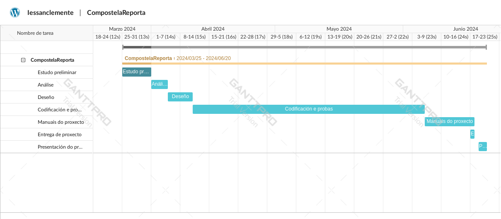
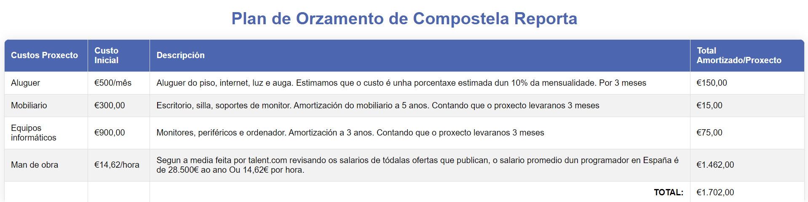

# Planificación e Orzamento

O obxectivo é planificar a execución do proxecto, desde o seu inicio ata, como mínimo, o momento da implantación. Basicamente, isto debe implicar:

1. Estruturar ou dividir o proxecto en fases, a partires dunha lóxica axustada as características e necesidades do proxecto.

## Calendario:

O proxecto lévase a cabo dende o día 25 de marzo que comezo co estudo preliminar ate o 17 de xuño, fecha límite para a entrega do proxecto.

### Fases del Proyecto

Puedes ver el detalle de las fases del proyecto en el siguiente documento: [Planificación de Compostela Reporta](./a2_planificacion.md)

1. Identificar os recursos dispoñibles para asignar ás distintas fases (humanos e materiais).
2. Estimar os tempos necesarios para a execución das distintas fases (en base aos recursos dispoñibles).
3. Elaborar un **cronograma do proxecto** (diagrama de Gantt) baseándose na información dos puntos 1, 2 e 3.

### Diagrama de gantt da planificación do proxecto

5. Calcular **orzamento**. Deben incluírse tanto recursos materiais como recursos humanos. Identificar necesidades de financiamento.

### Plan de orzamento

*A planificación do proxecto pode adaptarse ao uso de marcos de desenvolvemento áxiles, como Scrum, baseados no desenvolvemento incremental en base a ciclos ou iteracións relativamente curtas.*
